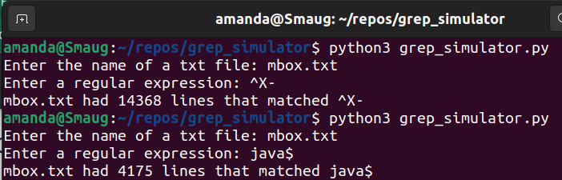

# grep_simulator
This is my solution to the first exercise in the book version of Python For Everybody, Chapter 11: Regular Expressions. It is a simple program that simulates the operation of the grep command on Unix.

The program asks the user for both a txt file name and a regular expression. A try and except within a while loop makes sure the txt file name is valid to prevent crashing the program. Then a for loop applies the regular expression to each line of the txt file and counts how many lines had a match. The result is printed.

Here is an example of the output run in my terminal:

